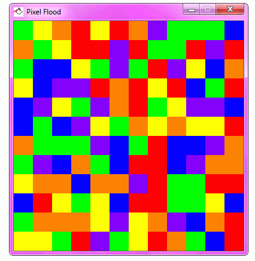

A set of puzzle and brain teaser games - written C, Go, and/or Python

## Pixel Flood

Generates a pixel grid in which the user must select one color at a time to paint the upper left square and flood into the same colors. The user must flood the entire grid with the same color in as few moves possible!

Controls:
- 1: Red
- 2: Green
- 3: Blue
- 4: Orange
- 5: Yellow
- 6: Purple
- n: New Puzzle
- Escape: Exit program

## Sudoku

A classic sudoku puzzle generator. Currently only command line.

`sudoku > puzzle.txt`

Will generate both the puzzle and solution. Default starts at 20 squares.
